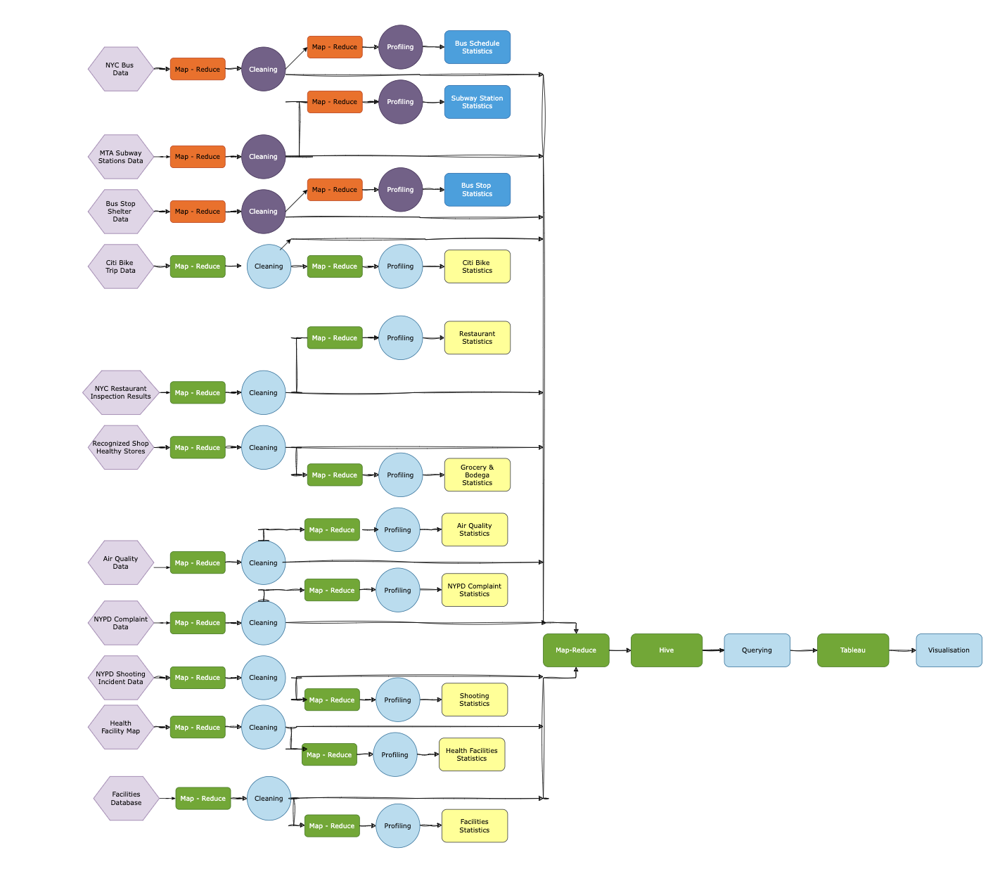

# RBDA Project Proposal
## Liveability Assessment Using Big Data Analytics

### Team
- Animesh Ramesh (ar8006)
- Efe Kalyoncu (ek2608)
- Suryakiran Sureshkumar (ss16030)
- Prasanna A P (pa2490)

### Abstract
As one of the most populous and diverse cities in the world, New York City presents a wide array of neighborhoods for residents to call home. However, quantifying the livability of different areas can be challenging due to the many factors that contribute to quality of life. This project aims to leverage open data sources to generate a data-driven livability score for neighborhoods across New York City's five boroughs. Datasets spanning transportation access, food availability, safety, public health, and local amenities will be integrated and analyzed. Key data sources include NYC open data on subway stations, bus stops, Citi Bike, restaurant inspections, recognized shop locations, 311 complaints, and health facility information. Geospatial analysis will be conducted to calculate metrics such as distance to transit, food access, green space, health resources, and more for each neighborhood. A weighted algorithm will be developed to generate an overall livability score on a scale from 1-100 for each neighborhood based on these underlying metrics. This work will demonstrate the power of unifying disparate open datasets to provide novel and actionable insights for public benefit. The methodology could be extended to other cities to generate similar livability indices.

### Introduction
Liveability is fundamentally shaped by the availability and accessibility of essential services and amenities that impact the daily lives of residents. This project aims to assess the liveability of neighborhoods through a focused examination of four critical dimensions: transportation, food availability, safety, and health facilities. By harnessing the power of Big Data Analytics, we will analyze comprehensive datasets from public sources to construct a multi-faceted liveability index that reflects the true quality of life.

### Key Dimensions

#### Transportation
A cornerstone of liveability, efficient transportation systems facilitate mobility and access to jobs, education, and services. We will evaluate the density and distribution of bus stops, subway stations, and Citi Bike stations to gauge the convenience and accessibility of public transportation options for residents across different neighborhoods.

#### Food Availability
Access to nutritious food is essential for health and well-being. By analyzing the location of restaurants and recognized shop healthy stores, including groceries and convenience stores, we aim to identify areas of food abundance and deserts, offering insights into the nutritional landscape of the city.

#### Safety
A safe environment is crucial for a high quality of life. Utilizing historic complaint and violent crimes data from the NYPD, we will assess the safety of neighborhoods, identifying areas with higher incidences of crime that may require targeted interventions to enhance resident security.

#### Health Facilities
The accessibility of health services is a key indicator of a neighborhood's liveability. Through the analysis of health facility locations, we will determine the adequacy of healthcare provision and its distribution across the city, highlighting areas with potential service gaps.

### Datasets

- **Bus Stop Shelters data**: Location of Bus Stop Shelters in NYC provided by NYC Department of Transportation.
- **MTA Subway Stations data**: Listing of all subway and Staten Island Railway stations with location and accessibility details.
- **Citi Bike Trip data**: Citi Bike trip data and station locations publicly available on Lyft City Bike site.
- **New York City Bus Data**: NYC MTA bus data including bus locations, routes, stops, and schedule adherence.
- **New York City Restaurant Inspection Results data**: Food safety inspections of NYC restaurants.
- **Recognized Shop Healthy Stores data**: Information on stores recognized for promoting healthier food options.
- **NYPD Complaint Data Historic**: Criminal complaints data providing details on offenses, locations, and participant demographics.
- **NYPD Shooting Incident data**: Shooting incidents data detailing occurrences and demographics.
- **Health Facility Map**: Inspection results for NYC restaurants and cafeterias covering violations and grades.
- **Air Quality data**: Information on air quality indicators and associated health burdens in NYC.
- **Facilities Database**: Information on over 30,000 facilities and program sites related to city, state, or federal services.

### Dataset Assignments

| Dataset                                 | Size       |
|-----------------------------------------|------------|
| Bus Stop Shelters data                  | 589 KB     |
| MTA Subway Stations                     | 65 KB      |
| Citi Bike Trip Data                     | 6.8 GB     |
| New York City Bus Data                  | 5.4 GB     |
| New York City Restaurant Inspection Results | 98.4 MB |
| Recognized Shop Healthy Stores data     | 79 KB      |
| NYPD Complaint Data Historic            | 2.84 GB    |
| NYPD Shooting Incident data             | 5.8 MB     |
| Health Facility Map                     | 2.4 MB     |
| Air Quality data                        | 1.9 MB     |
| Facilities Database                     | 16.8 MB    |

### Data Sources

- [Bus Stop Shelters](https://data.cityofnewyork.us/Transportation/Bus-Stop-Shelters/qafz-7myz)
- [MTA Subway Stations](https://data.ny.gov/Transportation/MTA-Subway-Stations/39hk-dx4f/about_data)
- [Citi Bike Trip Data](https://s3.amazonaws.com/tripdata/2023-citibike-tripdata.zip)
- [New York City Bus Data](https://www.kaggle.com/datasets/stoney71/new-york-city-transport-statistics/data?select=mta_1708.csv)
- [New York City Restaurant Inspection Results](https://data.cityofnewyork.us/Health/DOHMH-New-York-City-Restaurant-Inspection-Results/43nn-pn8j/about_data)
- [Recognized Shop Healthy Stores](https://data.cityofnewyork.us/Health/Recognized-Shop-Healthy-Stores/ud4g-9x9z/about_data)
- [NYPD Complaint Data Historic](https://data.cityofnewyork.us/Public-Safety/NYPD-Complaint-Data-Historic/qgea-i56i/about_data)
- [NYPD Shooting Incident Data](https://data.cityofnewyork.us/Public-Safety/NYPD-Shooting-Incident-Data-Historic-/833y-fsy8/data_preview)
- [Health Facility Map](https://health.data.ny.gov/Health/Health-Facility-Map/875v-tpc8)
- [Air Quality Data](https://data.cityofnewyork.us/Environment/Air-Quality/c3uy-2p5r/about_data)
- [Facilities Database](https://www.nyc.gov/site/planning/data-maps/open-data/dwn-selfac.page)

### Design

